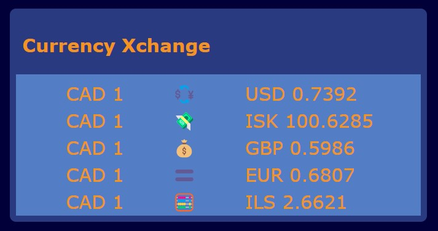

# Currency Xchange

A simple widget that fetches exchange rate data using ExchangeRate-API and converts $1 Canadian to various global currencies.

## Preview

## Built With

- JavaScript
- NodeJS

## Installation

To get a local copy up and running, follow the steps below:

Install NPM

`npm install npm@latest -g`

Install NPM packages

`npm install`

Run on local development server

`npm run start`

Open `index.html` in a local browser to view the widget

### Disclaimer

This project was built for educational purposes only. The exchange rate data shown is solely for illustrative and informational purposes. Any use of the data shown for actual financial transactions or decisions is explicitly forbidden.
